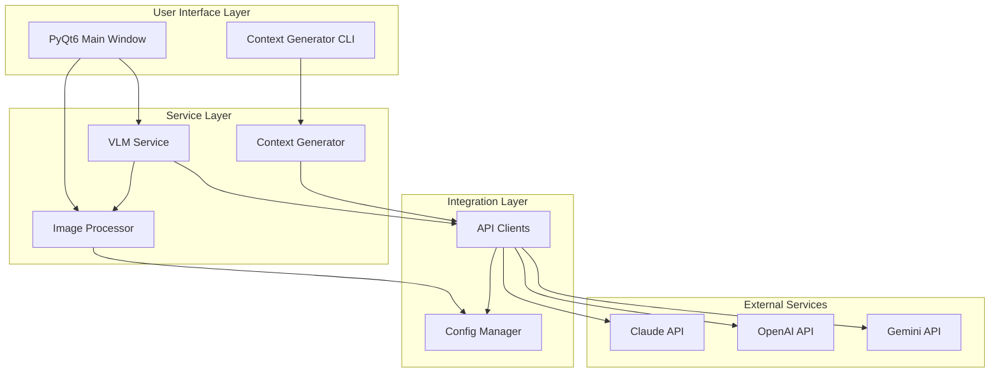
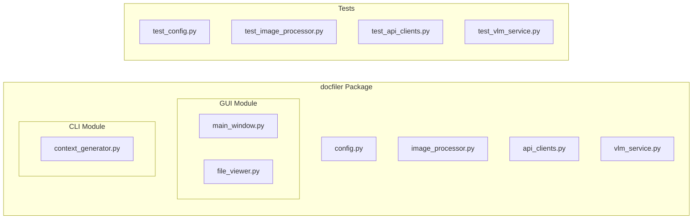
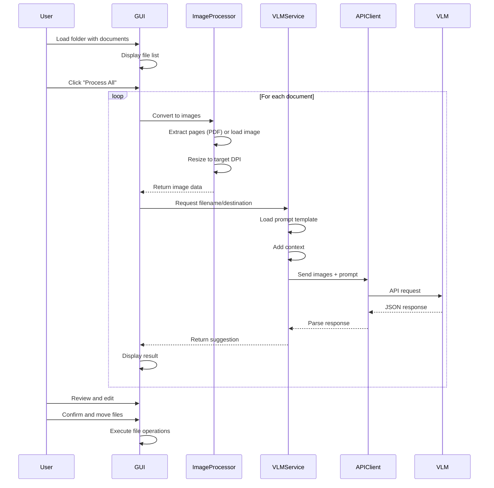

# Document Filer - Design Document

## Table of Contents
1. [Product Requirements](#product-requirements)
2. [Architecture](#architecture)
3. [Engineering Practices](#engineering-practices)
4. [Implementation Log](#implementation-log)
5. [TODO List](#todo-list)

---

## Product Requirements

### Overview
Document Filer is an AI-powered application that automatically suggests intelligent filenames and filing locations for scanned documents (PDFs and images). It uses Vision Language Models (VLMs) to analyze document content and suggest appropriate organizational schemes.

### Core Features

#### 1. Document Processing
- **Input Formats**: PDF files and images (PNG, JPG, JPEG, TIFF)
- **PDF Handling**: Extract first, middle, and last pages as images
- **Image Handling**: Process single image directly
- **Image Optimization**: Resize images to configurable DPI (default: 300)

#### 2. AI-Powered Analysis
- **VLM Integration**: Support for multiple providers (Claude, GPT-4, Gemini)
- **Output**: Suggested filename and destination path
- **Context-Aware**: Uses folder structure context for consistent organization

#### 3. PyQt6 GUI
- **File Browser Interface**: View and navigate input documents
- **Mass Processing**: Batch process multiple documents at once
- **Preview**: Click to view individual documents
- **Results Display**: Show suggested filename and destination for each file
- **Manual Override**: Edit filename or destination manually
- **Skip Option**: Clear destination to skip moving a file
- **Visual Feedback**: Progress indicators and status updates

#### 4. Context Generator (Headless)
- **Purpose**: Analyze existing folder structures to create filing conventions
- **Input**: Root directory path
- **Process**: Enumerate folders and files, send to LLM
- **Output**: Context describing filename encoding and folder organization
- **Use**: Provides context to VLM for consistent suggestions

#### 5. Configuration
- **Environment Variables**: API keys, model selection, processing parameters
- **Multi-Provider Support**: Claude (Anthropic), GPT (OpenAI), Gemini (Google)
- **Configurable Models**: Specify exact model versions in .env
- **Hyperparameters**: DPI, max dimensions, pages to extract

### Non-Functional Requirements
- **Modularity**: Clean separation of concerns
- **Testability**: Unit tests for all functions
- **Readability**: Self-documenting code structure
- **Maintainability**: Clear architecture and documentation

---

## Architecture

### System Architecture Diagram

### Component Architecture

### Data Flow Diagram

### Module Responsibilities

#### Top-Level Code (Human-Readable)
- `gui/main_window.py`: Entry point, orchestrates GUI flow
- `cli/context_generator.py`: Entry point for context generation

#### Mid-Level Code (Integrated Components)
- `vlm_service.py`: Coordinates VLM analysis workflow
- `image_processor.py`: Handles all image/PDF operations
- `api_clients.py`: Manages API communication with providers

#### Low-Level Code (Unit-Testable Functions)
- `config.py`: Configuration loading and validation
- Individual helper functions within each module

---

## Engineering Practices

### Code Organization Principles

#### 1. Three-Layer Architecture
- **Top Layer**: High-level orchestration, readable function calls, no implementation details
- **Middle Layer**: Business logic, integration of components, workflow management
- **Bottom Layer**: Pure functions, single responsibility, easily testable

#### 2. Naming Conventions
- **Files**: `snake_case.py`
- **Classes**: `PascalCase`
- **Functions**: `snake_case`
- **Constants**: `UPPER_SNAKE_CASE`
- **Private members**: `_leading_underscore`

#### 3. Documentation Standards
- **Docstrings**: All public functions and classes
- **Type Hints**: All function signatures
- **Comments**: Only for non-obvious logic (prefer self-documenting code)
- **README**: User-facing setup and usage
- **Design Doc**: Technical architecture and decisions

#### 4. Testing Strategy
- **Unit Tests**: Test individual functions in isolation
- **Test Coverage**: Aim for >80% coverage
- **Test Data**: Minimal, representative test cases
- **Fixtures**: Reusable test data and mocks
- **Assertions**: Clear, specific, one per test when possible

#### 5. Code Quality
- **Linter**: Ruff for code quality and style
- **Formatter**: Ruff for consistent formatting
- **Line Length**: 100 characters maximum
- **Complexity**: Keep functions small and focused
- **Dependencies**: Minimal, well-maintained packages only

#### 6. Version Control
- **Commits**: Atomic, descriptive messages
- **Branches**: Feature branches for development
- **PRs**: Code review before merge
- **Tags**: Version releases

#### 7. Error Handling
- **Exceptions**: Use built-in exceptions when appropriate
- **Validation**: Validate inputs at system boundaries
- **Logging**: Structured logging with appropriate levels
- **User Feedback**: Clear error messages in GUI

#### 8. Configuration Management
- **Environment Variables**: Secrets and configuration
- **Defaults**: Sensible defaults with override capability
- **Validation**: Check configuration on startup
- **Documentation**: Template with examples

---

## Implementation Log

### Phase 1: Project Setup ✅
- [x] Created project structure
- [x] Configured pyproject.toml with dependencies
- [x] Set up ruff and pytest configuration
- [x] Created .env.template with all required settings
- [x] Created .gitignore
- [x] Created prompt.md template
- [x] Created design.md (this document)

### Phase 2: Core Utilities (In Progress)
- [ ] Implement config.py
- [ ] Implement image_processor.py
- [ ] Implement api_clients.py
- [ ] Write unit tests for core utilities

### Phase 3: Services
- [ ] Implement vlm_service.py
- [ ] Write unit tests for VLM service

### Phase 4: Context Generator
- [ ] Implement context_generator.py
- [ ] Write unit tests for context generator

### Phase 5: GUI
- [ ] Implement main_window.py
- [ ] Implement file_viewer.py
- [ ] Write GUI tests

### Phase 6: Documentation & Release
- [ ] Create comprehensive README.md
- [ ] Add usage examples
- [ ] Create sample documents for testing
- [ ] Final testing and bug fixes

---

## TODO List

### High Priority
- [ ] Implement configuration loader with validation
- [ ] Implement PDF to image conversion (first, middle, last pages)
- [ ] Implement image resizing to target DPI
- [ ] Create API client factory supporting Claude, OpenAI, Gemini
- [ ] Implement VLM service with prompt template system
- [ ] Build PyQt6 file browser interface
- [ ] Implement batch processing workflow
- [ ] Add manual editing capabilities in GUI

### Medium Priority
- [ ] Implement context generator script
- [ ] Add progress indicators for long operations
- [ ] Implement file move/rename operations
- [ ] Add error handling and user feedback
- [ ] Create comprehensive test suite
- [ ] Add logging throughout application

### Low Priority
- [ ] Add support for more image formats (BMP, GIF)
- [ ] Implement caching for prompt templates
- [ ] Add undo/redo for file operations
- [ ] Create batch operation presets
- [ ] Add export functionality (CSV of results)
- [ ] Implement keyboard shortcuts
- [ ] Add dark mode support
- [ ] Create installer/packager for distribution

### Future Enhancements
- [ ] Support for OCR on scanned images with poor quality
- [ ] Learning from user corrections to improve suggestions
- [ ] Cloud storage integration (Dropbox, Google Drive)
- [ ] Mobile companion app
- [ ] Automated watching of folders for new documents
- [ ] Integration with email to process attachments
- [ ] Multi-language support
- [ ] Advanced search and filtering in GUI
- [ ] Document preview with annotations
- [ ] Batch operations scheduling

### Technical Debt
- [ ] None yet (green field project)

---

## Design Decisions Log

### Decision 1: VLM Provider Architecture
- **Date**: 2026-01-01
- **Decision**: Support multiple VLM providers (Claude, OpenAI, Gemini) via factory pattern
- **Reasoning**: Future-proofs against API changes, allows users to choose based on cost/quality preferences
- **Alternatives Considered**: Single provider (Claude only)
- **Trade-offs**: More complex code, but better flexibility

### Decision 2: PDF Page Extraction
- **Date**: 2026-01-01
- **Decision**: Extract first, middle, and last pages of PDFs
- **Reasoning**: Balances comprehensive analysis with API cost/token limits
- **Alternatives Considered**: All pages, first page only, configurable count
- **Trade-offs**: May miss important info in middle pages, but 3 pages usually sufficient

### Decision 3: PyQt6 vs Other GUI Frameworks
- **Date**: 2026-01-01
- **Decision**: Use PyQt6 for GUI
- **Reasoning**: Native look and feel, excellent file browser widgets, cross-platform
- **Alternatives Considered**: Tkinter (too basic), Electron (too heavy), GTK (less cross-platform)
- **Trade-offs**: GPL license (or commercial license needed), but superior UX

### Decision 4: Configuration via .env
- **Date**: 2026-01-01
- **Decision**: Use .env file for configuration
- **Reasoning**: Standard practice, keeps secrets out of code, easy to manage
- **Alternatives Considered**: Config file (YAML/JSON), command-line args
- **Trade-offs**: Less structured than YAML/JSON, but simpler and more secure

### Decision 5: Three-Layer Code Architecture
- **Date**: 2026-01-01
- **Decision**: Enforce top/middle/bottom layer separation
- **Reasoning**: Improves testability, readability, and maintainability
- **Alternatives Considered**: Flat structure, MVC pattern
- **Trade-offs**: More boilerplate, but clearer responsibilities

---

## Questions for Product Direction

### To Be Discussed After MVP
1. Should we support cloud storage integration from day one?
2. What level of customization should users have over prompts?
3. Should context generation be automatic or manual?
4. Do we need a batch mode CLI in addition to GUI?
5. Should we implement a plugin system for custom processors?
6. What analytics/telemetry should we collect (if any)?
7. Should we support collaborative features (shared contexts)?
8. Do we need role-based access control for enterprise use?

---

**Document Version**: 1.0
**Last Updated**: 2026-01-01
**Status**: MVP Development In Progress
