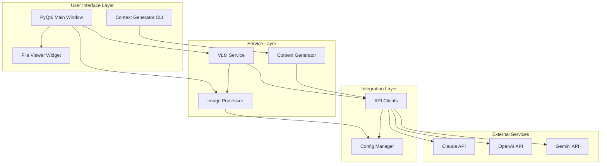
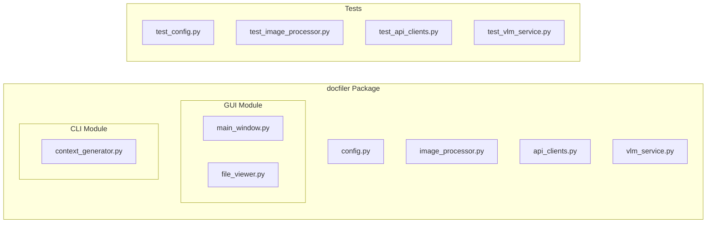
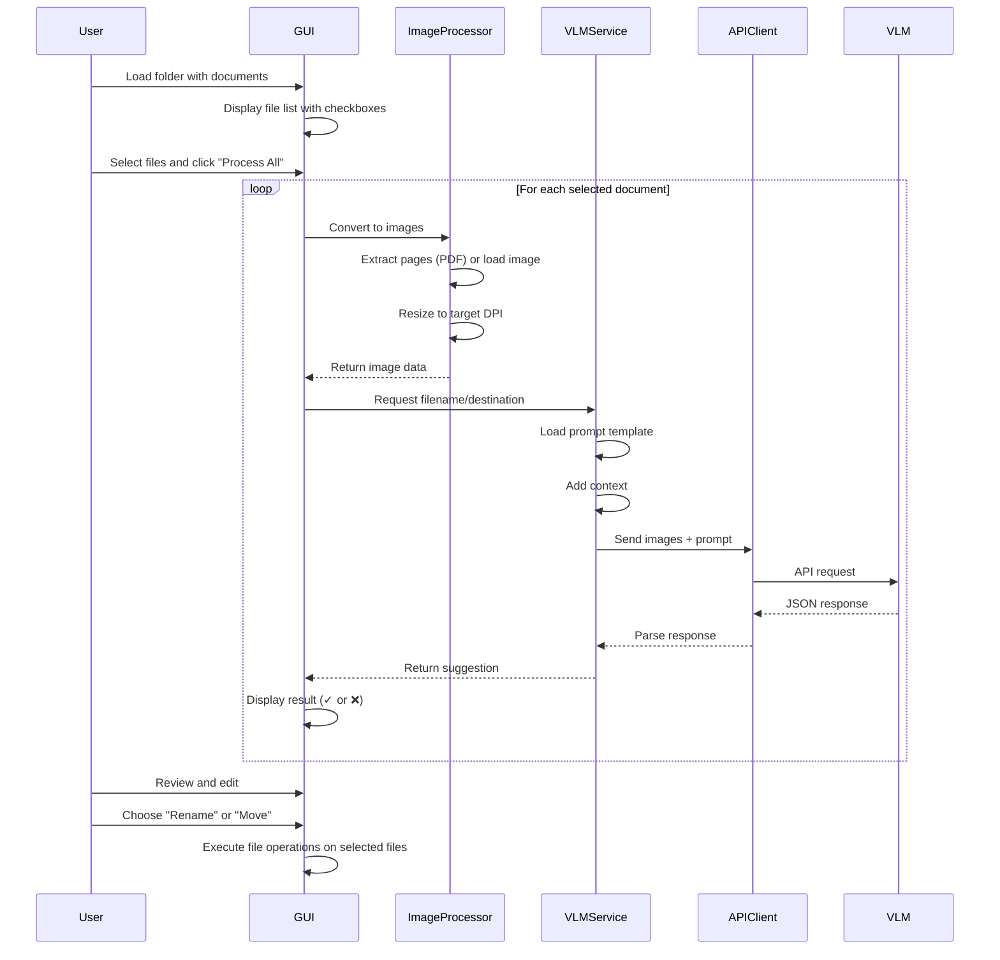

# Product Requirements & Architecture

> This document contains the product vision, technical architecture, open design decisions, and planned features for the Document Filer system.

## Overview

Document Filer is an AI-powered application that automatically suggests intelligent filenames and filing locations for scanned documents (PDFs and images). It uses Vision Language Models (VLMs) to analyze document content and suggest appropriate organizational schemes.

## Core Features

### 1. Document Processing
- **Input Formats**: PDF files and images (PNG, JPG, JPEG, TIFF, TIF, BMP)
- **PDF Handling**: 
  - Multi-strategy rendering: pdf2image (primary), pypdf image extraction (fallback)
  - Extracts first, middle, and last pages as images
  - Handles compressed/encoded images
- **Image Handling**: 
  - Process single image directly
  - Large image support (auto-resize images >4000px to prevent memory issues)
  - Handles Qt's 256MB allocation limit gracefully
- **Image Optimization**: Resize images to configurable DPI (default: 300)

### 2. AI-Powered Analysis
- **VLM Integration**: Support for multiple providers (Claude, GPT-4, Gemini)
- **Output**: Suggested filename and destination path with confidence score
- **Context-Aware**: Uses folder structure context for consistent organization
- **Reasoning**: Provides explanation for each suggestion

### 3. PyQt6 GUI
- **File Browser Interface**: 
  - QListView with QStandardItemModel for proper checkbox/selection separation
  - Checkboxes for file selection (independent of row selection)
  - Default directory: `~/GDrive/SHARED/__IN__`
  - Auto-loads default directory on startup
- **Mass Processing**: Batch process multiple documents at once with progress tracking
- **Preview**: 
  - Click to view individual documents
  - PDF preview with multiple fallback strategies
  - Large image support with automatic resizing
  - Visual feedback for loading errors
- **Results Display**: Show suggested filename, destination, confidence, and reasoning
- **Manual Override**: Edit filename or destination manually
- **File Selection**: 
  - Individual checkboxes for each file
  - "Select All" / "Select None" buttons
  - Separate selection from checkbox state
- **Execution Options**:
  - "Rename Selected Files (in place)" - renames without moving
  - "Move Selected Files" - moves to suggested destination
- **Visual Feedback**: Progress indicators, status updates, success/error markers (✓/❌)
- **Logging**: Comprehensive logging to both temp file and console

### 4. Context Generator (Headless CLI)
- **Purpose**: Analyze existing folder structures to create filing conventions
- **Input**: Root directory path
- **Process**: Enumerate folders and files, send to LLM
- **Output**: Context describing filename encoding and folder organization
- **Use**: Provides context to VLM for consistent suggestions
- **Implementation**: Fully functional CLI tool with text-only LLM calls

### 5. Configuration
- **Environment Variables**: API keys, model selection, processing parameters
- **Multi-Provider Support**: Claude (Anthropic), GPT (OpenAI), Gemini (Google)
- **Configurable Models**: Specify exact model versions in .env
- **Hyperparameters**: DPI, max dimensions, pages to extract
- **Default Paths**: Configurable default source and destination directories

## Non-Functional Requirements
- **Modularity**: Clean separation of concerns
- **Testability**: Unit tests for all functions
- **Readability**: Self-documenting code structure
- **Maintainability**: Clear architecture and documentation
- **Error Handling**: Comprehensive error logging with stack traces
- **User Experience**: Graceful degradation when features unavailable

---

## Architecture

### System Architecture Diagram



### Component Architecture



### Data Flow Diagram



### Module Responsibilities

#### Top-Level Code (Human-Readable)
- `gui/main_window.py`: Entry point, orchestrates GUI flow, file operations
- `gui/file_viewer.py`: Document preview with PDF/image rendering
- `cli/context_generator.py`: Entry point for context generation

#### Mid-Level Code (Integrated Components)
- `vlm_service.py`: Coordinates VLM analysis workflow
- `image_processor.py`: Handles all image/PDF operations
- `api_clients.py`: Manages API communication with providers

#### Low-Level Code (Unit-Testable Functions)
- `config.py`: Configuration loading and validation
- Individual helper functions within each module

---

## Current Implementation Status

### Completed Features ✅
- ✅ Multi-provider VLM support (Claude, OpenAI, Gemini)
- ✅ PyQt6 GUI with batch processing
- ✅ PDF and image processing with multiple fallback strategies
- ✅ Large image handling (auto-resize to prevent memory issues)
- ✅ Context generator CLI (fully functional)
- ✅ Unit test suite
- ✅ Configuration management via .env
- ✅ Comprehensive logging (temp file + console)
- ✅ File selection with checkboxes (separate from row selection)
- ✅ Separate rename vs. move operations
- ✅ Default directory support with auto-load
- ✅ PDF preview with pdf2image integration
- ✅ Error handling and visual feedback
- ✅ Progress tracking for batch operations
- ✅ Updated to google.genai API (from deprecated google.generativeai)

### Recent Improvements (2026-01-01)
- **Large Image Support**: PIL-based pre-processing for images >4000px
- **Better PDF Rendering**: Multi-strategy approach (pdf2image → pypdf → fallback)
- **Improved UX**: QListView with proper checkbox/selection separation
- **Enhanced Logging**: Dual logging to temp file and console with DEBUG/INFO levels
- **File Operations**: Separate "Rename" and "Move" buttons for better control
- **Error Resilience**: Graceful handling of compressed PDFs and large images

---

## Open Design Decisions

### High Priority Decisions

**Local LLM Integration Strategy**
- Should we support local LLM providers (Ollama, LM Studio, vLLM)?
- Trade-offs: Privacy and cost savings vs. accuracy and setup complexity
- Integration approach: Unified API vs. separate implementation path

**OCR Preprocessing Pipeline**
- Should OCR (Tesseract) be mandatory or optional preprocessing?
- When to use: Low-quality scans, handwritten documents, non-English text
- Performance impact: Additional processing time vs. improved accuracy

**Alternative ML Approaches**
- Should we offer a PyTorch/transformers-based classifier as alternative?
- Use case: Offline operation, custom training, enterprise deployment
- Trade-offs: Setup complexity, training data requirements, vs. flexibility

### Medium Priority Decisions

**Cloud Storage Integration**
- Which providers to support first? (Dropbox, Google Drive, OneDrive)
- Authentication approach: OAuth vs. API keys
- Sync strategy: One-way filing vs. bidirectional sync

**Prompt Customization**
- How much control should users have over prompts?
- UI approach: Simple templates vs. full prompt editing
- Caching strategy for custom prompts

**Context Generation**
- Should context be auto-generated on folder load?
- Caching and refresh strategy
- User override and manual editing capabilities

### Low Priority Decisions

**Plugin System Architecture**
- Extension points: Custom processors, file type handlers, destination resolvers
- Distribution mechanism: PyPI packages vs. local scripts
- Security considerations for third-party code

**Collaborative Features**
- Shared contexts across teams
- User corrections feedback loop
- Cloud-based configuration sync

**Enterprise Features**
- Role-based access control
- Audit logging
- Compliance and data retention policies

---

## Planned Features & Roadmap

### High Priority (Next Sprint)
- Improved context caching and refresh
- Undo/redo for file operations
- Keyboard shortcuts for common actions
- Export functionality (CSV of results)
- Dark mode support

### Medium Priority
- Batch operation presets
- Advanced search and filtering in GUI
- Document preview with annotations
- Multi-language support
- Installer/packager for distribution (PyInstaller/cx_Freeze)

### Future Enhancements
- OCR preprocessing with Tesseract for low-quality scans
- Local LLM provider support (Ollama, LM Studio, vLLM)
- Alternative ML implementation (PyTorch classifier)
- Learning from user corrections
- Cloud storage integration (Dropbox, Google Drive)
- Automated folder watching
- Email attachment processing
- Batch operations scheduling
- Mobile companion app

### Research & Exploration
- Evaluate local LLM performance vs. cloud APIs
- Compare vision-capable local models (LLaVA, BakLLaVA, CogVLM)
- Benchmark PyTorch classifier approach vs. VLM approach
- Investigate prompt caching strategies for cost optimization
- Explore multi-modal embedding approaches for similarity search

---

## Design Decisions Log

### Decision 1: VLM Provider Architecture
- **Date**: 2026-01-01
- **Decision**: Support multiple VLM providers (Claude, OpenAI, Gemini) via factory pattern
- **Reasoning**: Future-proofs against API changes, allows users to choose based on cost/quality preferences
- **Alternatives Considered**: Single provider (Claude only)
- **Trade-offs**: More complex code, but better flexibility

### Decision 2: PDF Page Extraction
- **Date**: 2026-01-01
- **Decision**: Extract first, middle, and last pages of PDFs
- **Reasoning**: Balances comprehensive analysis with API cost/token limits
- **Alternatives Considered**: All pages, first page only, configurable count
- **Trade-offs**: May miss important info in middle pages, but 3 pages usually sufficient

### Decision 3: PyQt6 vs Other GUI Frameworks
- **Date**: 2026-01-01
- **Decision**: Use PyQt6 for GUI
- **Reasoning**: Native look and feel, excellent file browser widgets, cross-platform
- **Alternatives Considered**: Tkinter (too basic), Electron (too heavy), GTK (less cross-platform)
- **Trade-offs**: GPL license (or commercial license needed), but superior UX

### Decision 4: Configuration via .env
- **Date**: 2026-01-01
- **Decision**: Use .env file for configuration
- **Reasoning**: Standard practice, keeps secrets out of code, easy to manage
- **Alternatives Considered**: Config file (YAML/JSON), command-line args
- **Trade-offs**: Less structured than YAML/JSON, but simpler and more secure

### Decision 5: Three-Layer Code Architecture
- **Date**: 2026-01-01
- **Decision**: Enforce top/middle/bottom layer separation
- **Reasoning**: Improves testability, readability, and maintainability
- **Alternatives Considered**: Flat structure, MVC pattern
- **Trade-offs**: More boilerplate, but clearer responsibilities

### Decision 6: QListView with QStandardItemModel
- **Date**: 2026-01-01
- **Decision**: Use QListView + QStandardItemModel instead of QListWidget with custom widgets
- **Reasoning**: Proper separation of checkbox state and selection, better UX
- **Alternatives Considered**: QListWidget with QCheckBox widgets
- **Trade-offs**: Slightly more complex setup, but much better user experience

### Decision 7: Separate Rename vs Move Operations
- **Date**: 2026-01-01
- **Decision**: Provide separate buttons for "Rename (in place)" and "Move to destination"
- **Reasoning**: Users often want to rename without moving, or vice versa
- **Alternatives Considered**: Single "Execute" button with combined operation
- **Trade-offs**: More UI complexity, but better control and flexibility

### Decision 8: PIL for Large Image Handling
- **Date**: 2026-01-01
- **Decision**: Use PIL to pre-process large images before loading into QPixmap
- **Reasoning**: Qt has 256MB allocation limit; PIL can resize before conversion
- **Alternatives Considered**: Increase Qt limit, reject large images
- **Trade-offs**: Extra processing step, but enables handling of very large images

---

## Technical Notes

### Dependencies
- **Core**: PyQt6, Pillow, pypdf, python-dotenv
- **AI Providers**: anthropic, openai, google-genai
- **PDF Rendering**: pdf2image (requires poppler-utils system package)
- **Testing**: pytest, pytest-cov, pytest-qt
- **Code Quality**: ruff

### Installation Requirements
```bash
# Python dependencies
pip install -e .

# System dependencies (for pdf2image)
sudo apt-get install poppler-utils  # Ubuntu/Debian
brew install poppler                 # macOS
```

### Logging
- **Location**: `/tmp/docfiler_YYYYMMDD_HHMMSS.log`
- **Console**: INFO level
- **File**: DEBUG level with full stack traces
- **Format**: Timestamp, module, level, message

### File Operations
- **Rename**: Renames files in current directory
- **Move**: Moves files to suggested destination (creates directories as needed)
- **Safety**: Checks for existing files, requires user confirmation
- **Feedback**: Shows success/error counts, updates UI with ✓/❌ markers

---

**Document Version**: 3.0
**Last Updated**: 2026-01-01
**Status**: MVP Complete with Recent Enhancements
