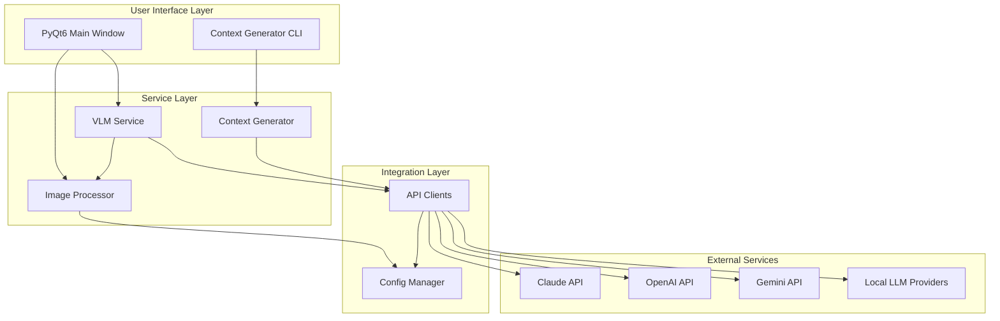
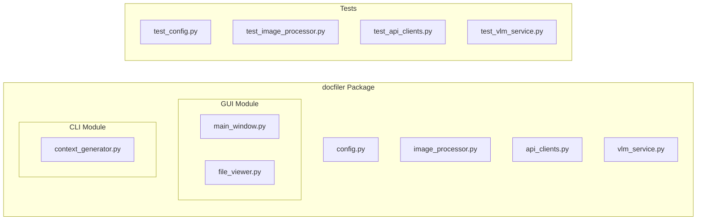
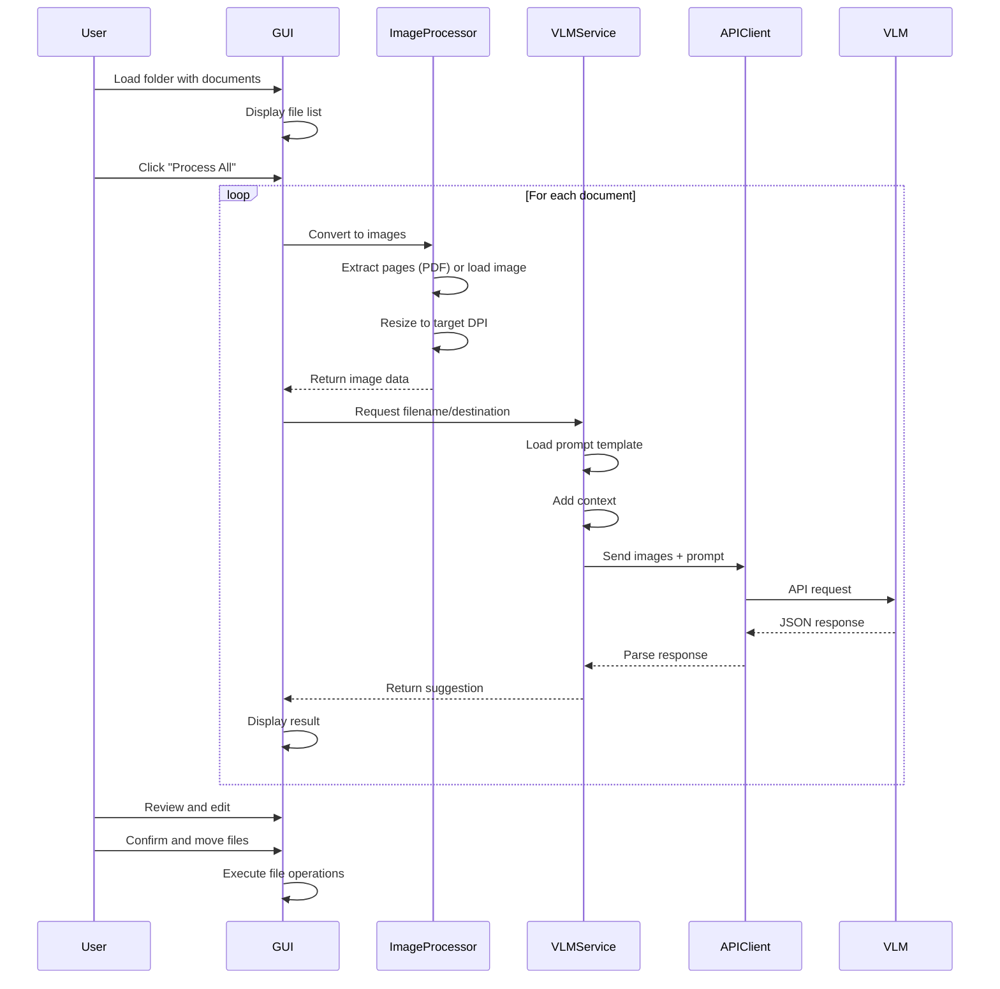

# Product Requirements & Architecture

> This document contains the product vision, technical architecture, open design decisions, and planned features for the Document Filer system.

## Overview

Document Filer is an AI-powered application that automatically suggests intelligent filenames and filing locations for scanned documents (PDFs and images). It uses Vision Language Models (VLMs) to analyze document content and suggest appropriate organizational schemes.

## Core Features

### 1. Document Processing
- **Input Formats**: PDF files and images (PNG, JPG, JPEG, TIFF)
- **PDF Handling**: Extract first, middle, and last pages as images
- **Image Handling**: Process single image directly
- **Image Optimization**: Resize images to configurable DPI (default: 300)

### 2. AI-Powered Analysis
- **VLM Integration**: Support for multiple providers (Claude, GPT-4, Gemini)
- **Output**: Suggested filename and destination path
- **Context-Aware**: Uses folder structure context for consistent organization

### 3. PyQt6 GUI
- **File Browser Interface**: View and navigate input documents
- **Mass Processing**: Batch process multiple documents at once
- **Preview**: Click to view individual documents
- **Results Display**: Show suggested filename and destination for each file
- **Manual Override**: Edit filename or destination manually
- **Skip Option**: Clear destination to skip moving a file
- **Visual Feedback**: Progress indicators and status updates

### 4. Context Generator (Headless)
- **Purpose**: Analyze existing folder structures to create filing conventions
- **Input**: Root directory path
- **Process**: Enumerate folders and files, send to LLM
- **Output**: Context describing filename encoding and folder organization
- **Use**: Provides context to VLM for consistent suggestions

### 5. Configuration
- **Environment Variables**: API keys, model selection, processing parameters
- **Multi-Provider Support**: Claude (Anthropic), GPT (OpenAI), Gemini (Google)
- **Configurable Models**: Specify exact model versions in .env
- **Hyperparameters**: DPI, max dimensions, pages to extract

## Non-Functional Requirements
- **Modularity**: Clean separation of concerns
- **Testability**: Unit tests for all functions
- **Readability**: Self-documenting code structure
- **Maintainability**: Clear architecture and documentation

---

## Architecture

### System Architecture Diagram

### Component Architecture

### Data Flow Diagram

### Module Responsibilities

#### Top-Level Code (Human-Readable)
- `gui/main_window.py`: Entry point, orchestrates GUI flow
- `cli/context_generator.py`: Entry point for context generation

#### Mid-Level Code (Integrated Components)
- `vlm_service.py`: Coordinates VLM analysis workflow
- `image_processor.py`: Handles all image/PDF operations
- `api_clients.py`: Manages API communication with providers

#### Low-Level Code (Unit-Testable Functions)
- `config.py`: Configuration loading and validation
- Individual helper functions within each module

---

## Open Design Decisions

### High Priority Decisions

**Local LLM Integration Strategy**
- Should we support local LLM providers (Ollama, LM Studio, vLLM)?
- Trade-offs: Privacy and cost savings vs. accuracy and setup complexity
- Integration approach: Unified API vs. separate implementation path

**OCR Preprocessing Pipeline**
- Should OCR (Tesseract) be mandatory or optional preprocessing?
- When to use: Low-quality scans, handwritten documents, non-English text
- Performance impact: Additional processing time vs. improved accuracy

**Alternative ML Approaches**
- Should we offer a PyTorch/transformers-based classifier as alternative?
- Use case: Offline operation, custom training, enterprise deployment
- Trade-offs: Setup complexity, training data requirements, vs. flexibility

### Medium Priority Decisions

**Cloud Storage Integration**
- Which providers to support first? (Dropbox, Google Drive, OneDrive)
- Authentication approach: OAuth vs. API keys
- Sync strategy: One-way filing vs. bidirectional sync

**Prompt Customization**
- How much control should users have over prompts?
- UI approach: Simple templates vs. full prompt editing
- Caching strategy for custom prompts

**Context Generation**
- Should context be auto-generated on folder load?
- Caching and refresh strategy
- User override and manual editing capabilities

### Low Priority Decisions

**Plugin System Architecture**
- Extension points: Custom processors, file type handlers, destination resolvers
- Distribution mechanism: PyPI packages vs. local scripts
- Security considerations for third-party code

**Collaborative Features**
- Shared contexts across teams
- User corrections feedback loop
- Cloud-based configuration sync

**Enterprise Features**
- Role-based access control
- Audit logging
- Compliance and data retention policies

---

## Planned Features & Roadmap

### Completed (MVP)
- Multi-provider VLM support (Claude, OpenAI, Gemini)
- PyQt6 GUI with batch processing
- PDF and image processing
- Context generator CLI
- Unit test suite
- Configuration management

### High Priority (Next Sprint)
- Support for more image formats (BMP, GIF)
- Implement caching for prompt templates
- Add progress indicators for long operations
- Improved error handling and user feedback
- Logging throughout application

### Medium Priority
- Undo/redo for file operations
- Batch operation presets
- Export functionality (CSV of results)
- Keyboard shortcuts
- Dark mode support
- Installer/packager for distribution

### Future Enhancements
- OCR preprocessing with Tesseract for low-quality scans
- Local LLM provider support (Ollama, LM Studio, vLLM)
- Alternative ML implementation (PyTorch classifier)
- Learning from user corrections
- Cloud storage integration (Dropbox, Google Drive)
- Automated folder watching
- Email attachment processing
- Multi-language support
- Advanced search and filtering in GUI
- Document preview with annotations
- Batch operations scheduling

### Research & Exploration
- Evaluate local LLM performance vs. cloud APIs
- Compare vision-capable local models (LLaVA, BakLLaVA, CogVLM)
- Benchmark PyTorch classifier approach vs. VLM approach
- Investigate prompt caching strategies for cost optimization
- Explore multi-modal embedding approaches for similarity search

---

## Design Decisions Log

### Decision 1: VLM Provider Architecture
- **Date**: 2026-01-01
- **Decision**: Support multiple VLM providers (Claude, OpenAI, Gemini) via factory pattern
- **Reasoning**: Future-proofs against API changes, allows users to choose based on cost/quality preferences
- **Alternatives Considered**: Single provider (Claude only)
- **Trade-offs**: More complex code, but better flexibility

### Decision 2: PDF Page Extraction
- **Date**: 2026-01-01
- **Decision**: Extract first, middle, and last pages of PDFs
- **Reasoning**: Balances comprehensive analysis with API cost/token limits
- **Alternatives Considered**: All pages, first page only, configurable count
- **Trade-offs**: May miss important info in middle pages, but 3 pages usually sufficient

### Decision 3: PyQt6 vs Other GUI Frameworks
- **Date**: 2026-01-01
- **Decision**: Use PyQt6 for GUI
- **Reasoning**: Native look and feel, excellent file browser widgets, cross-platform
- **Alternatives Considered**: Tkinter (too basic), Electron (too heavy), GTK (less cross-platform)
- **Trade-offs**: GPL license (or commercial license needed), but superior UX

### Decision 4: Configuration via .env
- **Date**: 2026-01-01
- **Decision**: Use .env file for configuration
- **Reasoning**: Standard practice, keeps secrets out of code, easy to manage
- **Alternatives Considered**: Config file (YAML/JSON), command-line args
- **Trade-offs**: Less structured than YAML/JSON, but simpler and more secure

### Decision 5: Three-Layer Code Architecture
- **Date**: 2026-01-01
- **Decision**: Enforce top/middle/bottom layer separation
- **Reasoning**: Improves testability, readability, and maintainability
- **Alternatives Considered**: Flat structure, MVC pattern
- **Trade-offs**: More boilerplate, but clearer responsibilities

---

**Document Version**: 2.0
**Last Updated**: 2026-01-01
**Status**: MVP Complete, Planning Next Phase
